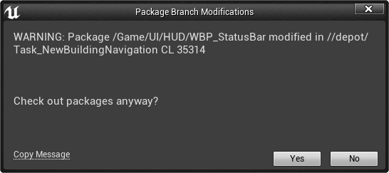

# BYG Cross-Branch Locking Plugin

Unreal Engine has an under-documented feature that allows the editor to check other branches for the locked status of
files. This is useful if you check out a binary asset on a branch, you don't want someone in another branch to make
edits because you would not be able to merge those changes later.

## Usage

Install the plugin as normal, then go to `Project Settings > BYG Cross Branch Lock`.

There specify the path to the Unreal Content directory, relative to your Perforce root.
e.g. `MyProject/Content`

Next, add the names of the branches you wish to check for locking.
e.g. `//depot/Development`, `//depot/SomeFeatureBranch`

With this set-up, attempting to check out a file that is already checked out on another branch will show a warning like this:

Based on [Unreal Fest Europe 2019
talk](https://www.youtube.com/watch?v=p4RcDpGQ_tI&t=1722s)

## Caveats

* Only works with Perforce.
* Task branches seem to act a little weird with it.

## License

[CC0](https://creativecommons.org/publicdomain/zero/1.0/)

## Contact

If you find it useful, drop me a line [@_benui](https://twitter.com/_benui) on Twitter

[benui.ca](https://benui.ca)
